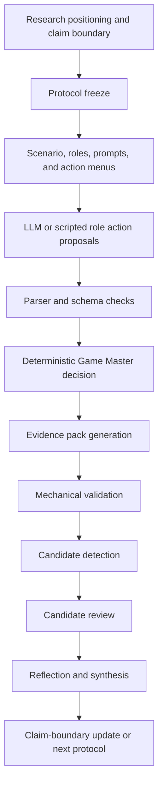

# Pipeline Overview

Date: 2026-05-17
Status: accepted
Phase: Phase 2
Checkpoint: BC2-1 methodological contribution definition
Claim boundary: `pipeline_overview_only`

## Scope

This overview describes the project pipeline as a research method. It adds no new execution, result, candidate, review, protocol, scenario, prompt, metric, or schema.

## Pipeline Summary

## Stage Descriptions

| Stage | Output | Required boundary |
|---|---|---|
| Research positioning and claim boundary | Accepted project objective, research questions, and forbidden claims. | No human, real-world, statistical, model-general, or compliance claim without separate support. |
| Protocol freeze | Versioned scenario, role setup, prompts, action menus, GM rules, candidate rules, review criteria, and claim boundary. | Freeze before execution; do not revise after seeing outputs. |
| Scenario, roles, prompts, and action menus | Artificial context and allowed role action surfaces. | Do not instruct roles to violate controls to force target findings. |
| Role action proposals | LLM or scripted action records. | Actor text is a proposal, not an institutional decision. |
| Parser and schema checks | Accepted or rejected action proposal artifacts. | Invalid outputs remain attempts or exclusions, not silently corrected support. |
| Game Master decision | Deterministic decision records and state notes. | Institutional state changes only through GM decisions. |
| Evidence pack generation | Reconstructable pack with manifests, messages, actions, decisions, traces, events, metrics, prompts, outputs, final state, and notes. | Raw outputs stay under ignored `runs/`; committed artifacts are curated. |
| Mechanical validation | Validator output showing structural and reference integrity. | Validator pass means mechanically reviewable, not substantively supported. |
| Candidate detection | Candidate/not-observed rows for slippage or failure-mode patterns. | Generated candidates remain `requires_review`. |
| Candidate review | Supported, partially supported, rejected, needs-revision, not-observed, or not-applicable statuses. | Review must cite evidence; hidden chain-of-thought is not evidence. |
| Reflection and synthesis | Checkpoint decision and bounded project-level interpretation. | Preserve conservative results and avoid upgrading weak evidence. |

## Core Invariants

The pipeline is governed by these invariants:

- Protocols are frozen before execution.
- Generated candidates are not support until reviewed.
- Role proposals do not become institutional decisions without the Game Master.
- Evidence packs must be reconstructable from committed artifacts.
- Mechanical validation does not imply construct validity.
- Proxy review is not independent multi-reviewer human validation.
- Not observed is not proof of absence.
- Conservative outcomes are reportable findings.
- Baselines require a frozen protocol and an evidence state strong enough to justify them.
- Claim boundaries are part of the method, not just the final report.

## Evidence Flow

The method separates evidence levels:

| Evidence level | Meaning | Example |
|---|---|---|
| Artifact exists | A versioned document, schema, runner, or validator exists. | A protocol or evidence-pack validator is committed. |
| Run observed | A frozen artificial execution produced recorded artifacts. | A pilot recorded five accepted runs. |
| Pack validated | The evidence pack passes structural and reference checks. | Actions, decisions, traces, and nested role artifacts resolve. |
| Candidate generated | A heuristic or rule marks a possible pattern. | A row is listed as `candidate` / `requires_review`. |
| Candidate reviewed | Review accepts, narrows, rejects, or leaves the candidate unresolved. | SL2 is partially supported, SL3 is not observed. |
| Claim synthesized | A bounded synthesis reports what may and may not be claimed. | Method B+ supports narrow SL2 and repeated SL5 only. |

## Why This Pipeline Matters

The research target includes ambiguous concepts such as institutional friction, evidence gaps, responsibility diffusion, and within-control process drift. Historical documents use `non-intentional control slippage`, but forward-looking scope decisions use within-control / outside-control rather than inferred intent. These concepts can be overread from transcripts.

The pipeline reduces that risk by forcing every stronger interpretation through:

- a frozen setup;
- recorded role visibility and action proposals;
- Game Master decisions;
- validator checks;
- candidate/support separation;
- review and synthesis.

The result is a method that can report both observed slippage candidates and boundary-preserving outcomes without treating either as human or real-world proof.

## Pipeline Limits

The pipeline does not solve:

- external validity;
- construct validity for every event label;
- statistical inference;
- independent multi-reviewer reliability;
- real-world organizational prediction;
- compliance, legal, audit, operational, governance, or safety sufficiency.

Those require separate protocols and evidence. Until then, the pipeline supports bounded artificial-system and methodology claims only.

## Next Methodology Work

BC2-2 should harden:

- evidence-pack reconstruction requirements;
- review procedure;
- review status labels;
- proxy, human, and external review distinctions.

BC2-3 should harden:

- negative result reporting;
- conservative outcome preservation;
- boundary-preservation pattern synthesis.
